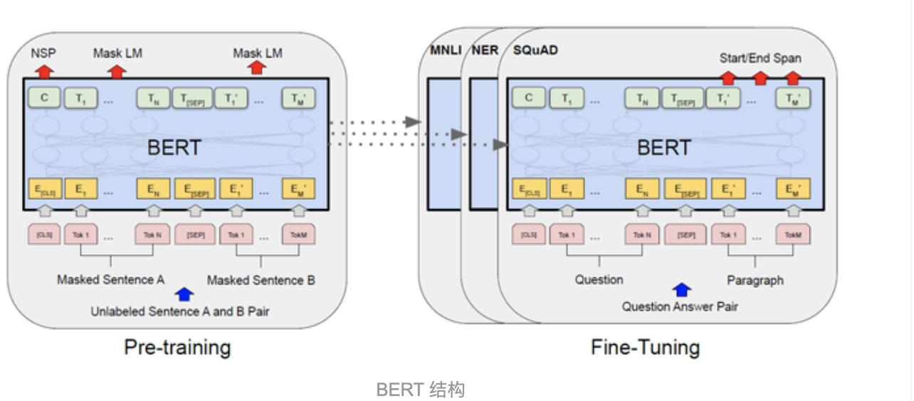
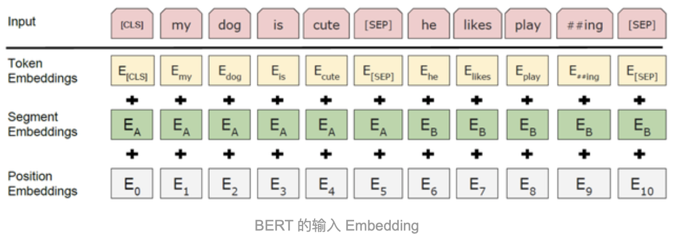
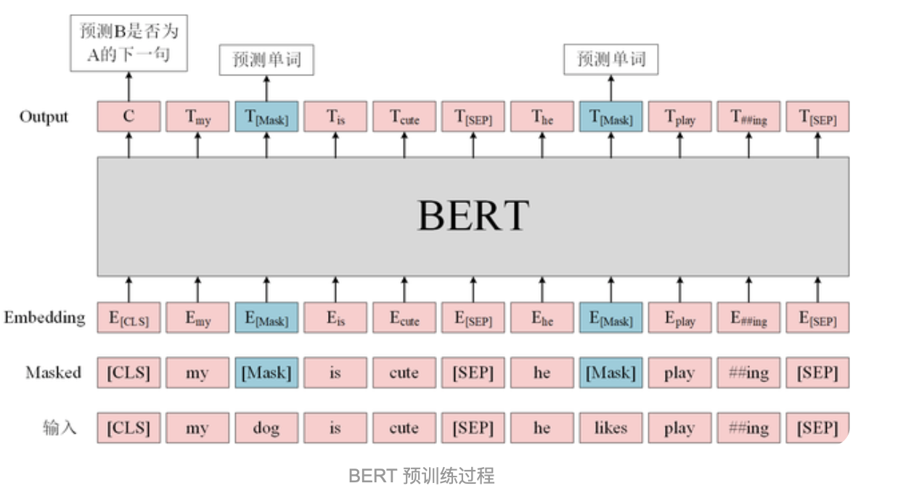

## **Bert**

## 结构

采用了Transformer的encoder结构，但是模型结构比Transformer要深。Transformer Encoder包含6个Encoder block，Bert-base模型包含12个encoder block， bert-large包含24个encoder block

### 输入

可以是一个句子，也可以是一个句子对（句子A和句子B）

* 特殊标志：

  1. [CLS]标志放在第一个句子的首位，经过 BERT 得到的的表征向量 **C** 可以用于后续的分类任务
  2. [SEP] 标志用于分开两个输入句子，例如输入句子 A 和 B，要在句子 A，B 后面增加 [SEP] 标志
  3. [MASK] 标志用于遮盖句子中的一些单词，将单词用 [MASK] 遮盖之后，再利用 BERT 输出的 [MASK] 向量预测单词是什么。

* Embedding：

  1. **Token embedding**: 单词的 Embedding，例如 [CLS] dog 等，通过训练学习得到。
  2. **Segment Embedding**: 用于区分每一个单词属于句子 A 还是句子 B，如果只输入一个句子就只使用 **E**A，通过训练学习得到。
  3. **Position Embedding**: 编码单词出现的位置，与 Transformer 使用固定的公式计算不同，BERT 的 Position Embedding 也是通过学习得到的，在 BERT 中，假设句子最长为 512。

  

### 预训练

bert预训练有两个任务

* Masked LM：在句子中随机用 [MASK] 替换一部分单词，然后将句子传入 BERT 中编码每一个单词的信息，最终用 [MASK] 的编码信息 **T**[MASK] 预测该位置的正确单词。
* 第二个是下一句预测，将句子 A 和 B 输入 BERT，预测 B 是否 A 的下一句，使用 [CLS] 的编码信息 **C**进行预测。

这两个任务是同时训练的。

#### **Masked LM**

以往语言模型预训练方式：

* **Word2Vec的CBOW**：没有考虑单词的顺序信息，只是将预测单词的窗口内的单词的embedding做了和，但其实是没有顺序信息在里面的。
* **ELMo**：ELMo 在训练的时候使用 biLSTM。前向 LSTM 会 Mask "自然" 之后的所有单词，使用上文 "我/喜欢/学习" 预测；后向 LSTM 会 Mask "自然" 之前的单词，使用下文 "语言/处理" 进行预测。然后再将前向 LSTM 和后向 LSTM 的输出拼接在一起，因此 ELMo 是将上下文信息分隔开进行预测的，而不是同时利用上下文信息进行预测。
* **OpenAI GPT**：OpenAI GPT 是另外一种使用 Transformer 训练语言模型的算法，但是 OpenAI GPT 使用的是 Transformer 的 Decoder，是一种单向的结构。预测 "自然" 的时候只使用上文 "我/喜欢/学习"，***Decoder 中包含了 Mask 操作，将当前预测词之后的单词都 Mask***。

**Mask LM 是用于防止信息泄露的**，例如预测单词 "自然" 的时候，如果不把输入部分的 "自然" Mask 掉，则预测输出的地方是可以直接获得 "自然" 的信息。

因此在训练时采用如下策略，随机选择句子中 15% 的单词进行 Mask，在选择为 Mask 的单词中，有 80% 真的使用 [Mask] 进行替换，10% 不进行替换，剩下 10% 使用一个随机单词替换。

* 80% 的概率，将句子 "my dog is hairy" 转换为句子 "my dog is [Mask]"。
* 10% 的概率，保持句子为 "my dog is hairy" 不变。
* 10% 的概率，将单词 "hairy" 替换成另一个随机词，例如 "apple"。将句子 "my dog is hairy" 转换为句子 "my dog is apple"。

#### **下一句子预测**

输入是A，B两个句子，要预测句子 B 是否是句子 A 的下一个句子。

例子：很多下游任务：问答系统，自然语言推断

训练的时候，有 50% 的概率会选择相连的两个句子 A B，有 50% 的概率会选择不相连得到两个句子 A B，然后通过 [CLS] 标志位的输出 **C**预测句子 A 的下一句是不是句子 B。

* 输入 = [CLS] 我 喜欢 玩 [Mask] 联盟 [SEP] 我 最 擅长 的 [Mask] 是 亚索 [SEP]类别 = B 是 A 的下一句
* 输入 = [CLS] 我 喜欢 玩 [Mask] 联盟 [SEP] 今天 天气 很 [Mask] [SEP]类别 = B 不是 A 的下一句

## 结论

BERT 使用了 Transformer 的 Encoder（但没有没有decoder，transformer的decoder是用于类似机器翻译这样的任务的） 和 Masked LM 预训练方法，因此可以进行双向预测；而 OpenAI GPT 使用了 Transformer 的 Decoder 结构，利用了 Decoder 中的 Mask，只能顺序预测。

## 优势

* 传统词向量的问题：
  * one-hot：维度灾难、语义鸿
  * LSA（矩阵分解）：利用全局预料，但svd求解计算复杂度大
  * word2vec：优化效率高，但是基于局部预料，其实静态的。
* elmo，GPT，bert的区别
  * elmo：采用LSTM进行提取，是两个单向语言模型（方向相反）的拼接，这种融合特征的能力比bert一体化融合特征方式弱。
  * GPT：GPT的单向语言模型采用transformer的decoder部分，decoder的部分见到的都是不完整的句子
  * bert：双向语言模型则采用transformer的encoder部分，采用了完整句子。

## 简单讲一下bert?

1. bert的结构和transformer差不多，只是用了transformer的encoder部分
2. 首先从输入讲起：输入分为三个部分的concat：token embedding，segment embedding和position embedding。token embedding是这个单词的embedding，segment embedding表示这个单词属于句子A还是句子B，position embedding有两种方式：一种是通过余弦定理计算出来的，另一种是自己学习的。
3. 再来讲一下网络结构：首先bert包含了12个bert-encoder block，每个block包含了multi-self-attention，Add&norm,FNN 三部分。
4. multi-attention：self-attention表示每个位置之间的相关度或者注意力是不一样的，那self-attention通过K和Q矩阵计算每个位置之间的相关度，然后再和V矩阵做矩阵乘法，最后就会得到每个单词经过注意力之后的输出嵌入。那之所以要用multi-attention的目的是形成多个子空间，让模型去关注不同的信息.
5. Add&norm: 对每层的输出嵌入去做一个normalization，这里用layer norm。layer norm是对每个单词内部做归一化，而batch norm是多句子之间的相同位置做归一化。显然句子相同位置做归一化没有意义。
6. 最后是FNN，其实，FFN的加入引入了非线性(ReLu激活函数)，变换了attention output的空间, 从而增加了模型的表现能力。把FFN去掉模型也是可以用的，但是效果差了很多。
7. 预训练的话，有两部分，Masked LM：在句子中随机用 [MASK] 替换一部分单词，然后将句子传入 BERT 中编码每一个单词的信息，最终用 [MASK] 的编码信息 **T**[MASK] 预测该位置的正确单词。第二个是下一句预测，将句子 A 和 B 输入 BERT，预测 B 是否 A 的下一句，使用 [CLS] 的编码信息 **C**进行预测。因为这两种预训练方式即能得到单词粒度的关系，也能得到句子间粒度的关系。

