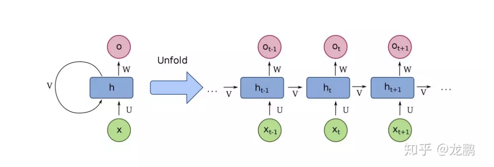
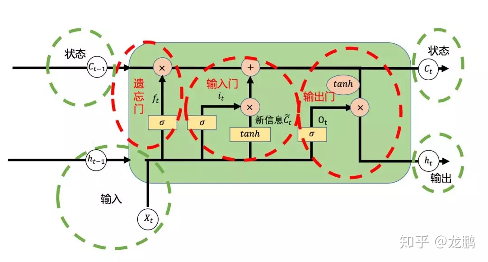
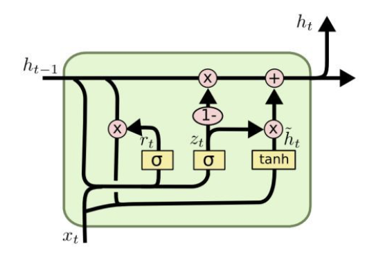

## RNN

**学习长期依赖的困难：**

* ${\partial h_T\over \partial h_t}={\partial h_T\over \partial h_{T-1}}{\partial h_{T-1}\over \partial h_{T-2}}\cdots{\partial h_{t+1}\over \partial h_t}$

* RNN梯度消失的原因：

  1. RNN和DNN梯度消失和梯度爆炸含义并不相同
  2. RNN中权重在各时间步内共享，最终的梯度是各个时间步的梯度和
  3. RNN中总的梯度是不会消失的，即使梯度越传越弱，也只是远距离的梯度消失
  4.  **RNN所谓梯度消失的真正含义是，梯度被近距离梯度主导，远距离梯度很小，导致模型难以学到远距离的信息**

* 长期依赖带来的信号很可能被隐藏，由于短期依赖的小小波动。

* 解决办法：
  * 结合short and long paths in unfoided flow graph
  * Leak units with self-connection:
   $h_{t+1}=(1-{1\over \alpha})h_t+ {1\over \alpha}tanh(W_{xh}x_t+W_{hh}h_t+b_n)$
    $h_{t+1}$是$h_t$的线性和非线性结合。
  * 反向传播误差更容易计算，因为有部分是线性的
  * $\alpha$控制遗忘的速率，也可以看作以往模型的滑动变化
  * $\alpha$可以是固定的也可以是学习的。
  
  

## LSTM

### forgeting gate 

希望随着时间的变化是不一样的，根据以前的隐藏层和现在的输入（根据目前的上下文）

$f_t=\sigma(W_{xf}X_t+W_{hf}h_{t-1}+b_f)$  **遗忘率**

**0表示完全舍弃，1表示完全保留**

$f_t \cdot c_{t-1}$ 是遗忘们的输出，代表上一次状态的信息有多少保留。

### input gate

代表了选择性记忆阶段，把当前输入重要的记录下来，不重要的少记一些.

$i_t=\sigma(W_{xi}X_t+W_{hi}h_{t-1}+b_i)$ **输入门**

$g_t=\tanh(W_{xc}X_t+W_{hc}h_{t-1}+b_c)$

$c_t=f_t\cdot c_{t-1}+i_t\cdot g_t$ **新的状态**

### output gate

$o_t=\sigma(W_{xo}X_t+W_{ho}h_{t-1}+b_o)$

$h_t=o_t\cdot tanh(c_t)$ **输出信息**

**决定了要从cell state中输出什么信息**

$z_t=softmax(W_{hz}h_t+b_z)$ **对输出做softmax任务**

### 优点

* 门控机制将输入信息，遗忘信息进行线性组合，极大减轻了梯度消失问题，极大的简化了调参复杂度
* 其次，门机制提供了特征过滤，将有用的特征保存，没用的特征丢弃，这极大的丰富了我们向量的表示信息

## GRU

### Reset gate

控制着是否重置，也就是说多大程度上擦除以前的状态state.

$r_t=\sigma(W_r\cdot[h_{t-1},x_t])$ **重置门**

$\bar{h_t}=tanh(W\cdot[r_t*h_{t-1},x_t])$ **表示需要重置的部分和此时可得输入信息拼接后的信息**

### update gate

多大程度上要用candidate 来更新当前的hidden layer

$z_t=\sigma(W_z\cdot[h_{t-1},x_t])$ **更新门**

$h_t=(1-z_t)*h_{t-1}+z_t*\bar{h_t}$ **重置部分的信息与原始信息的线性组合**

### 优点

* 参数少，好训练，结构相对简单
