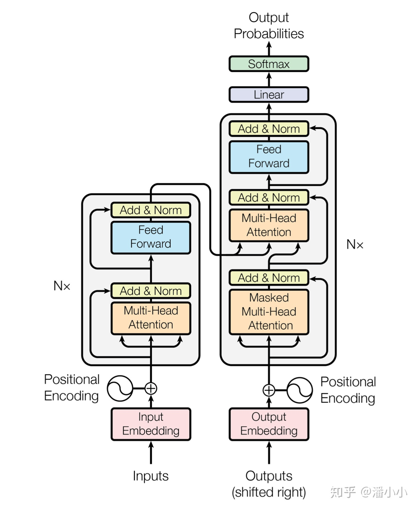
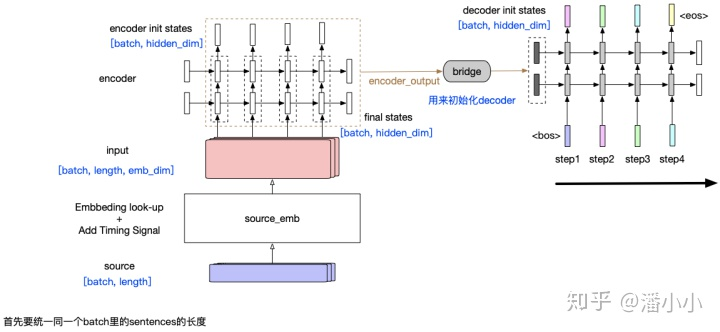
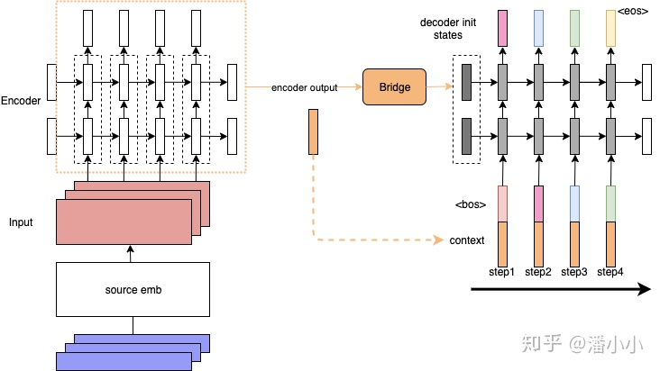
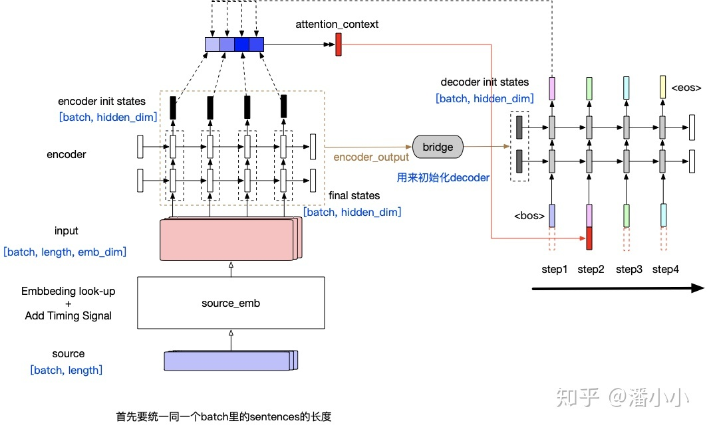
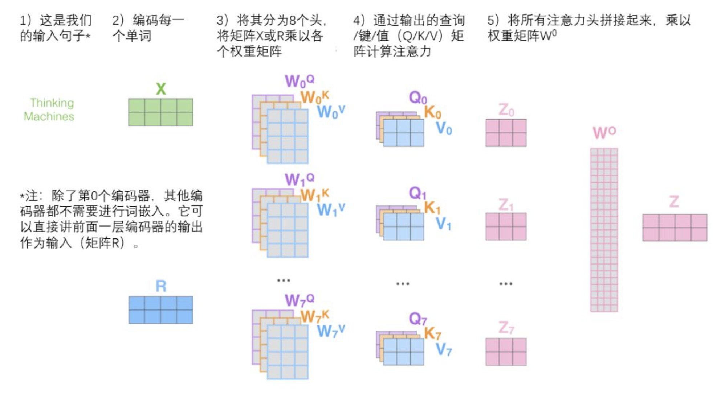
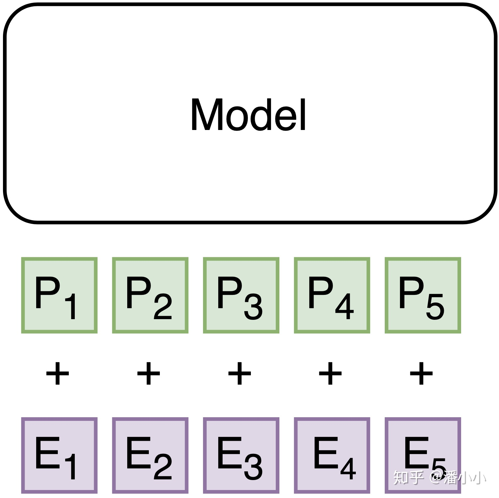

# Transformer

## Transformer 背景溯源

* simple RNN：将encoder的output作为decoder的initial states。这样会带来一个问题，就是随着decoder长度的增加，encoder output得信息回衰减。
  1. 源端序列不论长度都被压缩成一个固定维度的向量，向量信息中可能会遗忘序列的开头的token的信息

  2. 同样又RNN特性造成：随着decoder timestep的信息增加，initial hidden states中包含的encoder output相关信息也回衰减，decoder会逐渐遗忘源端序列的信息，而更多关注目标序列中在该timestep之前的token的信息。

* Contextualized RNN：为了解决上述第二个问题，即encoder output随着decoder timestep增加而信息衰减的问题，有人提出了一种加了context的RNN sequence to sequence模型。将encoded source sentence做为contex信息加入到encoder的每个timestep

  1. contex对于每一个timestep都是静态的。但是每个decoder端的token在解码时用到的contex其实是不一样的。

  

* Contextualized RNN with soft align(Attention): 在每个timestep输入到decoder RNN结构中之前，会用当前的输入token的vector与encoder output中的每一个position的vector作一个"attention"操作"，这个attention"操作的目的就是计算当前token与每个position之间的"相关度"，从而决定每个position的vector在最终该timestep的context中占的比重有多少。最终的context即encoder output每个位置vector表达的**加权平均**。
  $$
  att(q,X)=\sum_{i=1}^N \alpha_i X_i
  $$
  

## Attention的细节

### 计算

* 设输入序列的embedding 为Value $V \in R^{N\times d_v}$ , 维度为$d_v$ 

* 想对value 作每个位置的相关度，就需要一个相关度矩阵 $A \in R^{M\times N}$ 

* Query $Q \in R^{M\times d_{qk}}$ , Key $K \in R^{N\times d_{qk}}$   $Q\times K^T$ 得到的结果表示output每个位置对输入上的每个位置的关注度。M代表输出的序列长度， N代表输入的序列长度，$d_{qk}$ 是自己定的。
  $$
  A=Q\times K^T 
  $$

* 所以大致意思Query和Key作用得到的attention权值作用到Value上：
  $$
  Attention(Q,K,V)=softmax({QK^T\over\sqrt{d_k}})V
  $$
  
* $1\over \sqrt{d_k}$ 是缩放因子：

  1. 它的作用是归一化，使得A中的每个元素服从均值为0，方差为1的分布。
  2. 这样的分布是的训练过程中梯度值保持稳定

以机器翻译为例子：query对应的是需要**被表达**的序列(称为序列A)，key和value对应的是**用来表达**A的序列(称为序列B)。其中key和query是在同一高维空间中的(否则无法用来计算相似程度)，value不必在同一高维空间中，最终生成的output和value在同一高维空间中。上面这段巨绕的话用一句更绕的话来描述一下就是:

序列A和序列B在高维表达$A_\alpha$ 的每个位置分别和$\Beta_\alpha$ 计算相似度，产生的权重作用于序列B在高维空间$\beta$ 中的高维表达$B_\beta$ ,获得序列A在高维空间$\beta$ 中的高维表达$A_\beta$ 

**通过矩阵运算实现自注意力机制**：
$$
X \times W^Q=Q\\
X \times W^K=K\\
X \times W^V=V
$$

### Multi-head Attention

Multi-head attention 把query和key映射到高维空间$\alpha$ 的不同子空间$(\alpha_1,\alpha_2,\dots,\alpha_h)$ 中去计算相似度。我们有多个查询/键/值权重矩阵集(Transformer使用八个注意力头，因此我们对于每个编码器/解码器有八个矩阵集合)。这些集合中的每一个都是随机初始化的，在训练之后，每个集合都被用来将输入词嵌入(或来自较低编码器/解码器的向量)投影到不同的表示子空间中

Z是经过一个attention block之后的output

### Feed Forward Network

FFN包含了2层linear transformation层，中间的激活函数是ReLu

* 其实，FFN的加入引入了非线性(ReLu激活函数)，变换了attention output的空间, 从而增加了模型的表现能力。把FFN去掉模型也是可以用的，但是效果差了很多。

### Position Encoding

位置编码层只在encoder端和decoder端的embedding之后，第一个block之前出现，它非常重要，没有这部分，Transformer模型就无法用。位置编码是Transformer框架中特有的组成部分，补充了Attention机制本身不能捕捉位置信息的缺陷。Positional Embedding的成分直接叠加于Embedding之上，使得每个token的位置信息和它的语义信息(embedding)充分融合，并被传递到后续所有经过复杂变换的序列表达中去。因为transformer和RNN不一样，RNN可以捕捉序列的时间前后关系，而transformer的attention机制没有考虑序列时间关系。

### Mask

* padding-mask，用于处理不定长输入: 在 NLP 中，一个常见的问题是输入序列长度不等，一般来说我们会对一个 batch 内的句子进行 PAD，通常值为 0

* 另一种是 seqence-mask，为了防止未来信息不被泄露:

  也就是对于一个序列，在 time_step 为 t 的时刻，我们的解码输出应该只能依赖于 t 时刻之前的输出，而不能依赖 t 之后的输出。因此我们需要想一个办法，把 t 之后的信息给隐藏起来。产生一个上三角矩阵，上三角的值全为 1，下三角的值全为 0，对角线也是 0。把这个矩阵作用在每一个序列上，就可以达到我们的目的啦.

